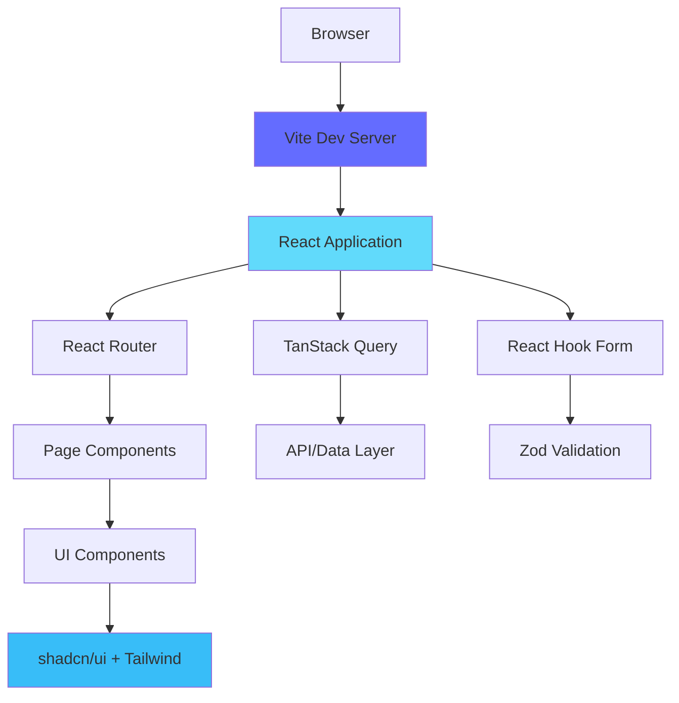

# Technology Stack Documentation

> A comprehensive guide to understanding the technologies, languages, and tools used in this project

## Table of Contents
- [Overview](#overview)
- [Project Architecture](#project-architecture)
- [Core Technologies](#core-technologies)
- [Styling & Design System](#styling--design-system)
- [Routing & State Management](#routing--state-management)
- [Form Handling & Validation](#form-handling--validation)
- [Development Tools](#development-tools)
- [Project Structure](#project-structure)
- [Learning Paths](#learning-paths)
- [Best Practices](#best-practices)

---

## Overview

This project is a modern, single-page personal portfolio website built with a cutting-edge web technology stack. The architecture emphasizes:

- **Type Safety**: TypeScript prevents runtime errors
- **Component Reusability**: React's component model
- **Performance**: Vite's lightning-fast HMR and optimized builds
- **Developer Experience**: Hot reload, ESLint, and modern tooling
- **Accessible UI**: shadcn/ui components built on Radix UI primitives
- **Maintainability**: Consistent design system with Tailwind CSS

### Technology Stack at a Glance

```
┌─────────────────────────────────────────────────────────┐
│                    User Interface                        │
├─────────────────────────────────────────────────────────┤
│  React Components (TSX) + shadcn/ui + Lucide Icons     │
├─────────────────────────────────────────────────────────┤
│         Tailwind CSS (Styling & Design System)          │
├─────────────────────────────────────────────────────────┤
│    React Router (Navigation) + TanStack Query (Data)    │
├─────────────────────────────────────────────────────────┤
│              TypeScript (Type System)                    │
├─────────────────────────────────────────────────────────┤
│        Vite (Build Tool & Development Server)           │
└─────────────────────────────────────────────────────────┘
```

---

## Project Architecture

### How Everything Works Together



**Development Flow:**
1. You write TypeScript/React code
2. Vite instantly compiles and hot-reloads changes
3. React re-renders affected components
4. Tailwind applies utility classes
5. Browser updates without full page refresh

**Build Flow:**
1. Vite bundles all code
2. TypeScript compiles to JavaScript
3. Tailwind purges unused CSS
4. Assets are optimized and minified
5. Static files ready for deployment

---

## Core Technologies

### 1. TypeScript

**What it is:**
TypeScript is a strongly-typed superset of JavaScript that compiles to plain JavaScript. It adds static type checking, interfaces, enums, and modern JavaScript features.

**Why we use it:**
- Catches errors at compile-time instead of runtime
- Provides autocomplete and IntelliSense in editors
- Makes refactoring safer and easier
- Documents code through type definitions
- Scales well for large applications

**In this project:**
- Configuration: `tsconfig.json`, `tsconfig.app.json`, `tsconfig.node.json`
- All `.tsx` and `.ts` files use TypeScript
- Strict mode enabled for maximum type safety

**Key Concepts:**
```typescript
// Interfaces for type safety
interface ButtonProps {
  text: string;
  onClick: () => void;
  variant?: 'primary' | 'secondary';
}

// Type inference
const user = { name: "John", age: 30 }; // TypeScript infers the type

// Generics
function identity<T>(arg: T): T {
  return arg;
}

// Union types
type Status = 'loading' | 'success' | 'error';
```

**Learning Resources:**
- 📘 [Official Documentation](https://www.typescriptlang.org/docs/)
- 🎓 [TypeScript Handbook](https://www.typescriptlang.org/docs/handbook/intro.html)
- 🎥 [TypeScript Course by Net Ninja](https://www.youtube.com/playlist?list=PL4cUxeGkcC9gUgr39Q_yD6v-bSyMwKPUI)
- 📚 [TypeScript Deep Dive (Free Book)](https://basarat.gitbook.io/typescript/)
- 🎓 [Execute Program - TypeScript](https://www.executeprogram.com/courses/typescript)
- 🎮 [TypeScript Exercises](https://typescript-exercises.github.io/)

**Best Practices:**
- Always define types for function parameters and return values
- Use interfaces for object shapes
- Leverage type inference when obvious
- Use `unknown` instead of `any` when type is truly unknown
- Enable strict mode in tsconfig.json

---

### 2. React 18.3.1

**What it is:**
React is a JavaScript library for building user interfaces through reusable components. It uses a virtual DOM for efficient updates and a declarative programming model.

**Why we use it:**
- Component-based architecture promotes reusability
- Virtual DOM ensures optimal performance
- Large ecosystem and community
- Excellent developer tools
- Concurrent features in React 18 (Suspense, Transitions)

**In this project:**
- Component files: `src/components/*.tsx`
- Pages: `src/pages/*.tsx`
- Main entry: `src/main.tsx`
- Root component: `src/App.tsx`

**Key Concepts:**
```typescript
// Functional Components
const Hero = () => {
  return <div>Hello World</div>;
};

// Props
interface UserProps {
  name: string;
  age: number;
}

const User: React.FC<UserProps> = ({ name, age }) => {
  return <div>{name} is {age} years old</div>;
};

// State Hook
const [count, setCount] = useState(0);

// Effect Hook
useEffect(() => {
  // Side effects here
  return () => {
    // Cleanup
  };
}, [dependencies]);

// Custom Hooks
const useLocalStorage = (key: string, initialValue: any) => {
  const [value, setValue] = useState(() => {
    const stored = localStorage.getItem(key);
    return stored ? JSON.parse(stored) : initialValue;
  });
  
  useEffect(() => {
    localStorage.setItem(key, JSON.stringify(value));
  }, [key, value]);
  
  return [value, setValue];
};
```

**Learning Resources:**
- 📘 [Official React Docs (New)](https://react.dev/)
- 🎓 [React Tutorial - Official](https://react.dev/learn)
- 🎥 [React Course by Codevolution](https://www.youtube.com/playlist?list=PLC3y8-rFHvwgg3vaYJgHGnModB54rxOk3)
- 📚 [Epic React by Kent C. Dodds](https://epicreact.dev/)
- 🎮 [React Challenges](https://reactchallenges.live/)
- 🎥 [Full React Course by freeCodeCamp](https://www.youtube.com/watch?v=bMknfKXIFA8)

**Best Practices:**
- Keep components small and focused (Single Responsibility)
- Use functional components and hooks
- Memoize expensive calculations with `useMemo`
- Optimize re-renders with `React.memo` and `useCallback`
- Lift state up when needed, but avoid prop drilling
- Use composition over inheritance

---

### 3. Vite

**What it is:**
Vite is a modern build tool that provides a lightning-fast development server with Hot Module Replacement (HMR) and optimized production builds using Rollup.

**Why we use it:**
- Instant server start (no bundling in dev)
- Lightning-fast HMR (< 100ms)
- Optimized builds with code splitting
- Native ES modules support
- Great TypeScript/React integration

**In this project:**
- Configuration: `vite.config.ts`
- Dev server runs on port 8080
- Path alias `@` points to `src/`
- SWC plugin for fast React compilation

**Key Features:**
```typescript
// vite.config.ts structure
export default defineConfig({
  server: {
    host: "::",      // Listen on all addresses
    port: 8080,      // Dev server port
  },
  plugins: [
    react(),         // React SWC plugin
  ],
  resolve: {
    alias: {
      "@": path.resolve(__dirname, "./src"), // @ = src/
    },
  },
});
```

**Commands:**
```bash
# Development server
npm run dev

# Build for production
npm run build

# Preview production build
npm run preview

# Lint code
npm run lint
```

**Learning Resources:**
- 📘 [Official Vite Documentation](https://vitejs.dev/)
- 🎓 [Vite Guide](https://vitejs.dev/guide/)
- 🎥 [Vite Crash Course](https://www.youtube.com/watch?v=LQQ3CR2JTX8)
- 📚 [Why Vite?](https://vitejs.dev/guide/why.html)
- 🔧 [Vite Plugins](https://vitejs.dev/plugins/)

**Best Practices:**
- Use environment variables with `import.meta.env`
- Leverage code splitting with dynamic imports
- Optimize assets (images, fonts) in `public/` folder
- Configure build options for production optimization
- Use Vite's built-in CSS modules and preprocessors

---

## Styling & Design System

### 4. Tailwind CSS

**What it is:**
Tailwind is a utility-first CSS framework that provides low-level utility classes to build custom designs without writing CSS.

**Why we use it:**
- Rapid development with utility classes
- Consistent design system through configuration
- No CSS naming conflicts
- Automatic purging of unused styles
- Responsive design made easy
- Dark mode support built-in

**In this project:**
- Configuration: `tailwind.config.ts`
- Base styles: `src/index.css`
- Custom colors, animations, and utilities
- HSL color system for theming

**Key Concepts:**
```html
<!-- Utility Classes -->
<button class="bg-primary text-white px-4 py-2 rounded-md hover:bg-primary/90">
  Click Me
</button>

<!-- Responsive Design -->
<div class="w-full md:w-1/2 lg:w-1/3">
  Responsive width
</div>

<!-- Dark Mode -->
<div class="bg-white dark:bg-gray-900">
  Content
</div>

<!-- Custom Classes (use sparingly) -->
<div class="gradient-text shadow-glow">
  Styled with custom utilities
</div>
```

**Design System Variables:**
```css
/* src/index.css */
:root {
  /* Colors - HSL format */
  --background: 0 0% 100%;
  --foreground: 0 0% 3.9%;
  --primary: 330 81% 67%;
  --primary-foreground: 0 0% 100%;
  
  /* Gradients */
  --gradient-primary: linear-gradient(135deg, hsl(var(--primary)), hsl(var(--primary-glow)));
  
  /* Shadows */
  --shadow-glow: 0 0 40px hsl(var(--primary-glow) / 0.4);
  
  /* Transitions */
  --transition-smooth: all 0.3s cubic-bezier(0.4, 0, 0.2, 1);
}
```

**Learning Resources:**
- 📘 [Official Tailwind Docs](https://tailwindcss.com/docs)
- 🎓 [Tailwind CSS Tutorial](https://tailwindcss.com/docs/utility-first)
- 🎥 [Tailwind CSS Full Course](https://www.youtube.com/watch?v=lCxcTsOHrjo)
- 🎮 [Tailwind Play (Online Playground)](https://play.tailwindcss.com/)
- 📚 [Tailwind UI Components](https://tailwindui.com/)
- 🎨 [Tailwind Color Generator](https://uicolors.app/create)

**Best Practices:**
- Use semantic color tokens (primary, secondary) not direct colors
- Extract common patterns to components, not CSS classes
- Use `@apply` sparingly (prefer utility classes)
- Configure custom values in tailwind.config.ts
- Use JIT mode for development speed
- Always use HSL colors for theming consistency

---

### 5. shadcn/ui

**What it is:**
shadcn/ui is a collection of reusable, accessible UI components built with Radix UI primitives and Tailwind CSS. Unlike traditional component libraries, you copy the component code into your project.

**Why we use it:**
- Full control over component code
- Accessible by default (ARIA compliant)
- Customizable with Tailwind
- No runtime dependencies (except Radix primitives)
- Beautiful, modern design
- TypeScript support

**In this project:**
- Components: `src/components/ui/*.tsx`
- Uses class-variance-authority for variants
- Integrated with design system tokens

**Available Components:**
- Buttons, Cards, Dialogs, Dropdowns
- Forms, Inputs, Labels, Textareas
- Toasts, Tooltips, Popovers
- Accordions, Tabs, Carousels
- And many more...

**Key Concepts:**
```typescript
// Button with variants
import { Button } from "@/components/ui/button";

<Button variant="default">Default</Button>
<Button variant="outline">Outline</Button>
<Button variant="ghost">Ghost</Button>
<Button size="lg">Large Button</Button>

// Using Dialog
import {
  Dialog,
  DialogContent,
  DialogDescription,
  DialogHeader,
  DialogTitle,
  DialogTrigger,
} from "@/components/ui/dialog";

<Dialog>
  <DialogTrigger>Open</DialogTrigger>
  <DialogContent>
    <DialogHeader>
      <DialogTitle>Dialog Title</DialogTitle>
      <DialogDescription>Dialog description</DialogDescription>
    </DialogHeader>
  </DialogContent>
</Dialog>

// Customizing components
const buttonVariants = cva(
  "base-classes",
  {
    variants: {
      variant: {
        default: "bg-primary text-primary-foreground",
        premium: "bg-gradient-primary text-white",
      },
    },
  }
);
```

**Learning Resources:**
- 📘 [shadcn/ui Documentation](https://ui.shadcn.com/)
- 🎓 [Component Examples](https://ui.shadcn.com/docs/components/accordion)
- 🎥 [shadcn/ui Tutorial](https://www.youtube.com/watch?v=1MTy3jTCZHo)
- 📚 [Radix UI Documentation](https://www.radix-ui.com/)
- 🎨 [Themes](https://ui.shadcn.com/themes)

**Best Practices:**
- Customize components in `src/components/ui/` to match your design
- Add new variants instead of inline className overrides
- Use semantic tokens from your design system
- Keep accessibility features intact when customizing
- Create wrapper components for common patterns

---

### 6. Lucide React

**What it is:**
Lucide is a fork of Feather Icons with more icons and active maintenance. It provides beautiful, consistent SVG icons as React components.

**Why we use it:**
- Tree-shakeable (only imports used icons)
- Consistent design language
- Customizable (size, color, stroke width)
- TypeScript support
- No runtime dependencies

**In this project:**
- Used throughout components for icons
- Imported individually for optimal bundle size

**Usage:**
```typescript
import { Mail, Github, Linkedin, ArrowRight, Menu, X } from 'lucide-react';

// Basic usage
<Mail className="w-5 h-5" />

// With props
<Github size={24} color="currentColor" strokeWidth={2} />

// With Tailwind classes
<Linkedin className="w-6 h-6 text-primary hover:text-primary/80" />

// In buttons
<Button>
  <ArrowRight className="ml-2" />
  Learn More
</Button>
```

**Learning Resources:**
- 📘 [Lucide Documentation](https://lucide.dev/)
- 🔍 [Icon Search](https://lucide.dev/icons/)
- 🎓 [React Guide](https://lucide.dev/guide/packages/lucide-react)
- 📦 [NPM Package](https://www.npmjs.com/package/lucide-react)

**Best Practices:**
- Import only icons you use (tree-shaking)
- Use `currentColor` to inherit text color
- Set consistent sizes with Tailwind classes
- Add accessibility labels when icons replace text

---

## Routing & State Management

### 7. React Router DOM

**What it is:**
React Router is the standard routing library for React applications, enabling navigation between different views/pages.

**Why we use it:**
- Client-side routing (no page reloads)
- Declarative routing with components
- Dynamic route parameters
- Nested routes support
- Programmatic navigation

**In this project:**
- Configuration: `src/App.tsx`
- Pages: `src/pages/Index.tsx`, `src/pages/NotFound.tsx`
- Current setup: Single-page with hash navigation

**Key Concepts:**
```typescript
import { BrowserRouter, Routes, Route, Link, useNavigate } from 'react-router-dom';

// Basic routing
<BrowserRouter>
  <Routes>
    <Route path="/" element={<Index />} />
    <Route path="/about" element={<About />} />
    <Route path="/projects/:id" element={<ProjectDetail />} />
    <Route path="*" element={<NotFound />} />
  </Routes>
</BrowserRouter>

// Navigation with Link
<Link to="/about">About</Link>

// Programmatic navigation
const navigate = useNavigate();
navigate('/projects');

// Access params
import { useParams } from 'react-router-dom';
const { id } = useParams();
```

**Learning Resources:**
- 📘 [Official React Router Docs](https://reactrouter.com/)
- 🎓 [React Router Tutorial](https://reactrouter.com/en/main/start/tutorial)
- 🎥 [React Router v6 Tutorial](https://www.youtube.com/watch?v=Ul3y1LXxzdU)
- 📚 [React Router FAQ](https://reactrouter.com/en/main/start/faq)

**Best Practices:**
- Use `<Link>` instead of `<a>` for internal navigation
- Implement 404 catch-all routes
- Use nested routes for layouts
- Lazy load route components for code splitting
- Use `useSearchParams` for query strings

---

### 8. TanStack Query (React Query)

**What it is:**
TanStack Query (formerly React Query) is a powerful data fetching and caching library for React applications.

**Why we use it:**
- Automatic caching and background updates
- Handles loading and error states
- Optimistic updates
- Pagination and infinite scrolling
- Request deduplication

**In this project:**
- Setup: `src/App.tsx` with `QueryClientProvider`
- Ready to use but not actively implemented yet
- Perfect for future API integrations

**Key Concepts:**
```typescript
import { useQuery, useMutation, useQueryClient } from '@tanstack/react-query';

// Fetching data
const { data, isLoading, error } = useQuery({
  queryKey: ['projects'],
  queryFn: async () => {
    const response = await fetch('/api/projects');
    return response.json();
  },
});

// Mutations (POST, PUT, DELETE)
const mutation = useMutation({
  mutationFn: (newProject) => {
    return fetch('/api/projects', {
      method: 'POST',
      body: JSON.stringify(newProject),
    });
  },
  onSuccess: () => {
    // Invalidate and refetch
    queryClient.invalidateQueries({ queryKey: ['projects'] });
  },
});

// Usage in component
if (isLoading) return <div>Loading...</div>;
if (error) return <div>Error: {error.message}</div>;
return <div>{data.map(project => ...)}</div>;
```

**Learning Resources:**
- 📘 [Official TanStack Query Docs](https://tanstack.com/query/latest)
- 🎓 [Quick Start Guide](https://tanstack.com/query/latest/docs/react/quick-start)
- 🎥 [React Query Tutorial](https://www.youtube.com/watch?v=novnyCaa7To)
- 📚 [React Query Examples](https://tanstack.com/query/latest/docs/react/examples/simple)
- 🎮 [React Query Essentials](https://ui.dev/c/react-query)

**Best Practices:**
- Use descriptive query keys
- Implement error boundaries
- Configure stale time based on data volatility
- Use optimistic updates for better UX
- Prefetch data when possible

---

## Form Handling & Validation

### 9. React Hook Form

**What it is:**
React Hook Form is a performant, flexible form library with easy validation integration.

**Why we use it:**
- Minimal re-renders (better performance)
- Easy integration with UI libraries
- Built-in validation
- TypeScript support
- Small bundle size

**In this project:**
- Installed and ready for Contact form
- Integrated with Zod for validation

**Key Concepts:**
```typescript
import { useForm } from 'react-hook-form';
import { zodResolver } from '@hookform/resolvers/zod';

interface FormData {
  name: string;
  email: string;
  message: string;
}

const MyForm = () => {
  const {
    register,
    handleSubmit,
    formState: { errors },
  } = useForm<FormData>({
    resolver: zodResolver(formSchema),
  });

  const onSubmit = (data: FormData) => {
    console.log(data);
  };

  return (
    <form onSubmit={handleSubmit(onSubmit)}>
      <input {...register('name')} />
      {errors.name && <span>{errors.name.message}</span>}
      
      <input {...register('email')} />
      {errors.email && <span>{errors.email.message}</span>}
      
      <textarea {...register('message')} />
      {errors.message && <span>{errors.message.message}</span>}
      
      <button type="submit">Submit</button>
    </form>
  );
};
```

**Learning Resources:**
- 📘 [Official React Hook Form Docs](https://react-hook-form.com/)
- 🎓 [Get Started Guide](https://react-hook-form.com/get-started)
- 🎥 [React Hook Form Tutorial](https://www.youtube.com/watch?v=CC3yB8ySGNw)
- 📚 [Advanced Usage](https://react-hook-form.com/advanced-usage)
- 🎮 [Form Builder](https://react-hook-form.com/form-builder)

**Best Practices:**
- Use `register` for simple inputs
- Use `Controller` for custom components
- Implement field-level validation for better UX
- Reset form after successful submission
- Handle async validation properly

---

### 10. Zod

**What it is:**
Zod is a TypeScript-first schema validation library with static type inference.

**Why we use it:**
- Type-safe validation schemas
- Excellent TypeScript integration
- Composable schemas
- Detailed error messages
- Works great with React Hook Form

**In this project:**
- Used with `@hookform/resolvers` for form validation
- Ready to implement for Contact form

**Key Concepts:**
```typescript
import { z } from 'zod';

// Define schema
const userSchema = z.object({
  name: z.string().min(2, 'Name must be at least 2 characters'),
  email: z.string().email('Invalid email address'),
  age: z.number().min(18, 'Must be 18 or older'),
  website: z.string().url().optional(),
});

// Infer TypeScript type from schema
type User = z.infer<typeof userSchema>;

// Validate data
const result = userSchema.safeParse(data);
if (result.success) {
  // result.data is typed as User
  console.log(result.data);
} else {
  // result.error contains validation errors
  console.log(result.error.issues);
}

// Complex schemas
const contactSchema = z.object({
  email: z.string().email(),
  message: z.string().min(10).max(500),
  subscribe: z.boolean().default(false),
  tags: z.array(z.string()).optional(),
});
```

**Learning Resources:**
- 📘 [Official Zod Documentation](https://zod.dev/)
- 🎓 [Zod Tutorial](https://zod.dev/?id=basic-usage)
- 🎥 [Zod in 100 Seconds](https://www.youtube.com/watch?v=L6BE-U3oy80)
- 📚 [Zod + React Hook Form](https://react-hook-form.com/get-started#SchemaValidation)
- 🎮 [Zod Playground](https://stackblitz.com/edit/zod-playground)

**Best Practices:**
- Define schemas outside components (reusability)
- Use `z.infer` to generate TypeScript types
- Provide clear, user-friendly error messages
- Compose complex schemas from simple ones
- Use `.transform()` for data normalization

---

## Development Tools

### 11. ESLint

**What it is:**
ESLint is a static code analysis tool for identifying and fixing problems in JavaScript/TypeScript code.

**Why we use it:**
- Enforces code quality standards
- Catches bugs before runtime
- Maintains consistent code style
- Integrates with editors (real-time feedback)
- Customizable rules

**In this project:**
- Configuration: `eslint.config.js`
- Rules: TypeScript recommended + React rules
- Unused vars warnings disabled

**Configuration:**
```javascript
export default tseslint.config({
  extends: [
    js.configs.recommended,
    ...tseslint.configs.recommended
  ],
  plugins: {
    "react-hooks": reactHooks,
    "react-refresh": reactRefresh,
  },
  rules: {
    ...reactHooks.configs.recommended.rules,
    "react-refresh/only-export-components": "warn",
    "@typescript-eslint/no-unused-vars": "off",
  },
});
```

**Learning Resources:**
- 📘 [ESLint Documentation](https://eslint.org/docs/latest/)
- 🎓 [ESLint Getting Started](https://eslint.org/docs/latest/use/getting-started)
- 🎥 [ESLint Tutorial](https://www.youtube.com/watch?v=qhuFviJn-es)
- 📚 [Configuring ESLint](https://eslint.org/docs/latest/use/configure/)

**Best Practices:**
- Fix linting errors before committing
- Use `// eslint-disable-next-line` sparingly
- Keep rules consistent across team
- Integrate with CI/CD pipeline

---

### 12. Bun / npm

**What it is:**
Package managers for installing and managing JavaScript dependencies. Bun is a fast all-in-one toolkit; npm is the default Node.js package manager.

**Why we use it:**
- Dependency management
- Script running
- Version control for packages
- Consistent environments across machines

**Common Commands:**
```bash
# Install dependencies
npm install
bun install

# Add a package
npm install <package-name>
bun add <package-name>

# Remove a package
npm uninstall <package-name>
bun remove <package-name>

# Run scripts
npm run dev
bun run dev

# Update packages
npm update
bun update
```

**Learning Resources:**
- 📘 [npm Documentation](https://docs.npmjs.com/)
- 📘 [Bun Documentation](https://bun.sh/docs)
- 🎓 [npm Guide](https://docs.npmjs.com/about-npm)
- 🎥 [Bun Tutorial](https://www.youtube.com/watch?v=dWqNgzZwVJQ)

---

## Project Structure

```
project-root/
├── public/                # Static assets (served as-is)
│   ├── favicon.ico
│   ├── robots.txt
│   └── placeholder.svg
│
├── src/
│   ├── assets/           # Images, fonts (processed by Vite)
│   │   └── profile-photo.jpg
│   │
│   ├── components/       # React components
│   │   ├── ui/          # shadcn/ui components
│   │   │   ├── button.tsx
│   │   │   ├── card.tsx
│   │   │   ├── dialog.tsx
│   │   │   └── ...
│   │   │
│   │   ├── About.tsx     # About section component
│   │   ├── Contact.tsx   # Contact section component
│   │   ├── Experience.tsx
│   │   ├── Footer.tsx
│   │   ├── Hero.tsx
│   │   ├── Navigation.tsx
│   │   ├── Projects.tsx
│   │   └── Stories.tsx
│   │
│   ├── hooks/           # Custom React hooks
│   │   ├── use-mobile.tsx
│   │   └── use-toast.ts
│   │
│   ├── lib/             # Utility functions
│   │   └── utils.ts     # cn() helper for className merging
│   │
│   ├── pages/           # Page components (routes)
│   │   ├── Index.tsx    # Main page (homepage)
│   │   └── NotFound.tsx # 404 page
│   │
│   ├── App.tsx          # Root React component with routing
│   ├── main.tsx         # Entry point (renders App)
│   ├── index.css        # Global styles & design system
│   └── vite-env.d.ts    # Vite TypeScript definitions
│
├── index.html           # HTML template
├── vite.config.ts       # Vite configuration
├── tailwind.config.ts   # Tailwind CSS configuration
├── tsconfig.json        # TypeScript configuration
├── eslint.config.js     # ESLint configuration
├── package.json         # Dependencies and scripts
└── README.md            # Project documentation
```

### File Naming Conventions

- **Components**: PascalCase (e.g., `Hero.tsx`, `NavLink.tsx`)
- **Utilities**: camelCase (e.g., `utils.ts`, `use-toast.ts`)
- **Config files**: kebab-case (e.g., `vite.config.ts`, `tailwind.config.ts`)
- **Pages**: PascalCase (e.g., `Index.tsx`, `NotFound.tsx`)

---

## Learning Paths

### 🎓 Beginner Path (New to Web Development)

**Phase 1: Fundamentals (2-3 months)**
1. **HTML & CSS**: [MDN Web Docs](https://developer.mozilla.org/en-US/docs/Learn)
2. **JavaScript**: [JavaScript.info](https://javascript.info/)
3. **Git**: [Git Handbook](https://guides.github.com/introduction/git-handbook/)

**Phase 2: Modern JavaScript (1-2 months)**
1. **ES6+ Features**: [ES6 Course](https://www.youtube.com/watch?v=WZQc7RUAg18)
2. **Async JavaScript**: Promises, async/await
3. **DOM Manipulation**

**Phase 3: React Basics (2-3 months)**
1. **React Official Tutorial**: [react.dev/learn](https://react.dev/learn)
2. **React Hooks**: useState, useEffect, custom hooks
3. **Component Design**: Props, composition, lifting state

**Phase 4: TypeScript (1-2 months)**
1. **TypeScript Basics**: Types, interfaces, generics
2. **TypeScript with React**: Typing props, hooks

**Phase 5: This Stack (1-2 months)**
1. **Vite**: Setup and configuration
2. **Tailwind CSS**: Utility-first approach
3. **React Router**: Client-side routing
4. **Forms**: React Hook Form + Zod

---

### 🚀 Intermediate Path (Know React Basics)

**Focus Areas (2-3 months):**
1. **TypeScript Deep Dive**
   - Advanced types (unions, intersections, mapped types)
   - Generics and utility types
   - TypeScript with React patterns

2. **Tailwind CSS Mastery**
   - Custom design systems
   - Component patterns
   - Responsive design best practices

3. **React Patterns**
   - Compound components
   - Render props vs hooks
   - Context API and state management

4. **Performance Optimization**
   - React.memo, useMemo, useCallback
   - Code splitting and lazy loading
   - Lighthouse audits

5. **Testing**
   - Vitest for unit tests
   - React Testing Library
   - E2E testing with Playwright

---

### 🔥 Advanced Path (Production-Ready Skills)

**Topics to Master:**
1. **Architecture**
   - Micro-frontends
   - Design patterns (SOLID principles)
   - State machines (XState)

2. **Advanced React**
   - Concurrent features (Suspense, Transitions)
   - Server components (React Server Components)
   - Advanced hooks patterns

3. **Performance**
   - Bundle optimization
   - Runtime performance profiling
   - Web Vitals optimization

4. **Accessibility**
   - WCAG 2.1 compliance
   - Screen reader testing
   - Keyboard navigation

5. **DevOps**
   - CI/CD pipelines
   - Docker containerization
   - Monitoring and logging

---

## Best Practices

### Code Organization
- ✅ Keep components small (< 200 lines)
- ✅ Extract reusable logic to custom hooks
- ✅ Use barrel exports (index.ts) for clean imports
- ✅ Colocate related files (component + styles + tests)

### Performance
- ✅ Lazy load routes and heavy components
- ✅ Memoize expensive calculations
- ✅ Optimize images (WebP, lazy loading)
- ✅ Use production builds for deployment
- ✅ Monitor bundle size with `vite build --debug`

### Accessibility
- ✅ Use semantic HTML (`<header>`, `<nav>`, `<main>`)
- ✅ Add ARIA labels where needed
- ✅ Ensure keyboard navigation works
- ✅ Maintain color contrast ratios (WCAG AA minimum)
- ✅ Test with screen readers

### TypeScript
- ✅ Enable strict mode in tsconfig.json
- ✅ Avoid `any` type (use `unknown` if needed)
- ✅ Define interfaces for all props
- ✅ Use type inference when obvious
- ✅ Leverage utility types (`Partial`, `Pick`, `Omit`)

### Styling
- ✅ Use semantic color tokens (not direct colors)
- ✅ Define design system in `index.css`
- ✅ Use HSL for all colors (easier theming)
- ✅ Create component variants, not inline overrides
- ✅ Mobile-first responsive design

### Git & Version Control
- ✅ Write descriptive commit messages
- ✅ Keep commits atomic (one feature/fix per commit)
- ✅ Use branches for features
- ✅ Review code before merging
- ✅ Use semantic versioning

---

## Common Patterns in This Project

### 1. Component Structure
```typescript
// Imports
import React from 'react';
import { Button } from '@/components/ui/button';
import { SomeIcon } from 'lucide-react';

// Types/Interfaces
interface MyComponentProps {
  title: string;
  onAction?: () => void;
}

// Component
export const MyComponent: React.FC<MyComponentProps> = ({ 
  title, 
  onAction 
}) => {
  // Hooks
  const [state, setState] = React.useState();
  
  // Event handlers
  const handleClick = () => {
    // logic
  };
  
  // Render
  return (
    <section className="py-20">
      <h2>{title}</h2>
      <Button onClick={handleClick}>Action</Button>
    </section>
  );
};
```

### 2. Design System Usage
```typescript
// ❌ Don't: Direct colors
<div className="bg-pink-500 text-white">

// ✅ Do: Semantic tokens
<div className="bg-primary text-primary-foreground">

// ❌ Don't: Inline overrides
<Button className="bg-white text-black hover:bg-gray-100">

// ✅ Do: Create variants
<Button variant="ghost">
```

### 3. Import Aliases
```typescript
// Use @ alias for src imports
import { Button } from '@/components/ui/button';
import { cn } from '@/lib/utils';
import Hero from '@/components/Hero';

// Not relative paths
import { Button } from '../../components/ui/button'; // ❌
```

---

## Troubleshooting

### Common Issues

**Vite dev server won't start**
```bash
# Clear cache and reinstall
rm -rf node_modules
rm package-lock.json
npm install
```

**TypeScript errors after adding new dependencies**
```bash
# Restart TypeScript server in VS Code
# Cmd/Ctrl + Shift + P -> "TypeScript: Restart TS Server"
```

**Tailwind classes not working**
- Check `tailwind.config.ts` content paths
- Ensure `@tailwind` directives are in `index.css`
- Clear browser cache
- Restart dev server

**Import errors with @ alias**
- Check `vite.config.ts` alias configuration
- Check `tsconfig.json` paths configuration
- Restart TypeScript server

---

## Additional Resources

### Communities
- [React Discord](https://discord.gg/react)
- [Vite Discord](https://chat.vitejs.dev/)
- [Tailwind Discord](https://tailwindcss.com/discord)
- [Reddit: r/reactjs](https://www.reddit.com/r/reactjs/)

### Blogs & Newsletters
- [React Status Newsletter](https://react.statuscode.com/)
- [JavaScript Weekly](https://javascriptweekly.com/)
- [CSS-Tricks](https://css-tricks.com/)
- [Kent C. Dodds Blog](https://kentcdodds.com/blog)
- [Josh W. Comeau Blog](https://www.joshwcomeau.com/)

### Tools
- [Can I Use](https://caniuse.com/) - Browser compatibility
- [Bundlephobia](https://bundlephobia.com/) - Package size analysis
- [TypeScript Playground](https://www.typescriptlang.org/play)
- [Tailwind Play](https://play.tailwindcss.com/)
- [React DevTools](https://react.dev/learn/react-developer-tools)

---

## Next Steps

Now that you understand the technology stack, here are some ways to continue learning:

1. **Build Something**: The best way to learn is by building. Try adding features to this portfolio.

2. **Read the Docs**: Spend time reading official documentation. It's comprehensive and well-written.

3. **Join Communities**: Ask questions, help others, and stay updated with latest trends.

4. **Practice Daily**: Consistency beats intensity. Code a little every day.

5. **Study Production Code**: Read popular open-source projects to see patterns used by experienced developers.

Happy coding! 🚀
